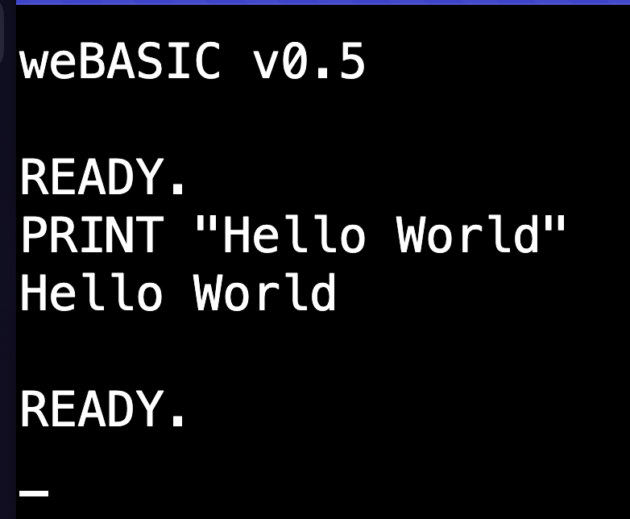

# Getting Started with weBASIC

Starting weBASIC brings you to the `READY.` prompt. A cursor (blinking underline) shows it is waiting for you.


## Your First Command

weBASIC is waiting for you to type a command.

In a world of mouse pointers and touch interface, this might seem a little old fashioned. _It is!_

However, if you are going to write code, you are going to have to type it in.
Further, dealing with a computer from a "command line" is common and expected for "computer people."
That's why you're hear right?

So let's type something in:

```BASIC
PRINT "Hello World"
```

You will get something like this:



_Congratulations_! You've made the computer do something for you.

## A Calculated Tutorial

Repeating what you tell it is not all that impressive. So let's make the computer do something useful. _Math_.

Just to make the point:

```BASIC
PRINT 2+2
```

The computer will responde with:

```
4
```

And wait for your next command.

We can do something more complicated:

```BASIC
PRINT -(2^4*9+14)
```

And you'll get:

```
-158
```

### Operator? Operator?

Did you understand every bit of that last equation? Let's break it down:

```BASIC
-(2^4*9+14)
```

What does that mean? And how is it calculated?

#### Start with Parentheses

The first rule of any equation is that things inside parentheses are done first.

In our equation we have:

<pre><code style="color:darkgray;">-<b style="color:yellow;">(</b>2^4*9+14<b style="color:yellow;">)</b></code></pre>

Why are those parentheses there? Let's try it without:

```BASIC
-2^4*9+14
```

The result is:

```
158
```

What happened to that being negative?

#### Keeping It In Order

The computer has an "order of operations". This means that an equation is broken apart into
pieces, and these pieces are calculated in order of the "importance" of the operators.

One of the less important operators is the negation (also called "unary minus") operator. Pretty much
everything has precedence over that. That means without the parenthesis to separate that negation from
the rest of the equation, the first value is negative two (-2) and that is the value used to calculate
the first operation.

Which is a "caret" (^). What does that mean?

#### Who Has The Power?

The "caret" (^) operator means "to the power of".

So:

<pre><code style="color:darkgray;">-(<span style="color:white;">2<b style="color:yellow;">^</b>4</span>*9+14)</code></pre>

Means "two to the power of four", or two times two times two times two.

The result is:

```
16
```

It so happens that the "power" operator (the caret) is the highest priority operator in the order of operations.

That's why without the parentheses, the first operation done is `-2^4`, which is 16. The negative is lost.

So, if the "power" operator is at the top of the order of operations, what's next?

Multiplication and division. There's a multiplication in our equation...do you see it?

#### Get With the Times

In math, multiplication is represented by a tilted cross or plus sign, like this: &#215;

You might notice that key isn't on your keyboard. It is quite possible on your modern computer there is a way
you can get that multiplication symbol to show up. But when BASIC was created it was based on languages that
came before, and that symbol simply didn't exist anywhere on the keyboards of the day (with one interesting
exception that you'll have to discover elsewhere).

The asterisk (*) symbol _was_ common on every keyboard back then, just as it is today. And that was the symbol
chosen to represent multiplication.

So:

<pre><code style="color:darkgray;">-(<span style="color:white;">2^4<b style="color:yellow;">*</b>9</span>+14)</code></pre>

Means multiply the result of `2^4` (16) by 9. That gets a result of:

```
144
```

Note that just as the standard multiplication symbol isn't available on your keyboard, 
the standard division symbol (&#247;) is not there either. BASIC, and pretty much every
other computer language, uses the slash (/) as the division operator.

#### What's Left to Add?

Unlike multiplication and division, the symbols for addition (+) and subtraction (-) _are_
on your keyboard. So just use those.

<pre><code style="color:darkgray;">-(<span style="color:white;">2^4*9<b style="color:yellow;">+</b>14</span>)</code></pre>

Are you following this now? The total of everything (within the parentheses) to the left of
the plus sign (+) -- equalling 144 -- is added to 14, for a total of:

```
158
```

#### Feeling Negative

Now we're back to that opening minus sign (-), the one we mentioned earlier negates the value
it follows. That means:

<pre><code style="color:white;"><b style="color:yellow;">-</b>(2^4*9+14)</code></pre>

Since everything inside the parentheses totals up to 158, negating that gets you:

```
-158
```

The final answer.

----
##### Thinking Like a Computer

Take a look at the following equation:

```BASIC
PRINT 4--2
```

That might look like a typo at first. Two minus signs right together?

But the computer is going to see it by priority of operators. Even though the minus sign (-)
pulls double duty as both the subtraction operator and the negation operator, the computer
will figure it out.

As it scans from left to right, it hits the first minus sign (-). Since it has just
seen a number (4), it knows this must be an operator: subtraction.

Now the computer is going to find the operands -- what is on the left and right of this
operator that needs to be subtracted?  Looking left it sees the 4. Looking right it sees...
a minus sign (-).

But since it is looking for a value (not an operator), it assumes that must be a negation
operation, which itself looks right to see the 2, so that means the right operand of our
subtraction is the result of "negate two" (-2).

From there, the computer steps back to the subtraction operation, which is now 
"four minus negative two" (4 - -2), and totals it up to get:

```
6
```
----

### What's Your Function?

Let's look at another equation:

```BASIC
PRINT SIN(3.1415926)
```

The computer will come back with:

```
5.3589793170057245e-8
```

Maybe you'll recognize that's a really small number. We'll come back to that in a moment.

What's this `SIN` about? SIN is how BASIC represents the geometric SINE _function_.

A function is something that takes a value (sometimes more, sometimes _none_) and
applies some formula to it to return a new value. The value you want the function
to operate on must always be placed in parentheses following the function name.

So:

<pre><code style="color:darkgray;"><b style="color:yellow;">SIN</b>(3.1415926)</code></pre>

Means get the sine of 3.1415926, which is _close to_ pi (&pi;). Note that the function SIN
takes a value in [Radians](https://en.wikipedia.org/wiki/Radian), where the circumference of
a circle is equal to twice pi (2*&pi;)

#### It's Science!

So the sine of pi is 0, but 3.1415926 is not _quite_ pi.  The sine of pi is zero (0). But the sine of 3.1415926 is _close_ to zero.
A very small number, as mentioned above. If you take the sign of pi on, for example, the
built-in scientific calulator on a mac, you get:


weBASIC returns a value of:

```
5.3589793170057245e-8
```

These are the same number. weBASIC has formatted the answer in **Scientific Notation**.
This means value is shifted by a power of 10 greater or less until there is one significant
digit before the decimal. Then the power of 10 is noted at the end of the number followed by
an `e`.

So:

 - <pre><code>100 = 1&times;10<sup>2</sup> = 1e2</code></pre>
 - <pre><code>0.01 = 1&times;10<sup>-2</sup> = 1e-2</code></pre>
 - <pre><code>0.000000053589793 = 5.3589793&times;10<sup>-8 = 5.3589793170057245e-8</sup></code></pre>

### Where to Next?

There is much more you can do directly from the `READY.` prompt in weBASIC, but very little of it
is useful if you can't keep it and reuse it.

That means it is time to write some programs.

[Why don't you go write one?](./first-program.md)

- [Home](./index.md)
- [Your First weBASIC Program](./first-program.md)
- [Learn the weBASIC Language](./language.md)
- [weBASIC reference](./reference/index.md)
