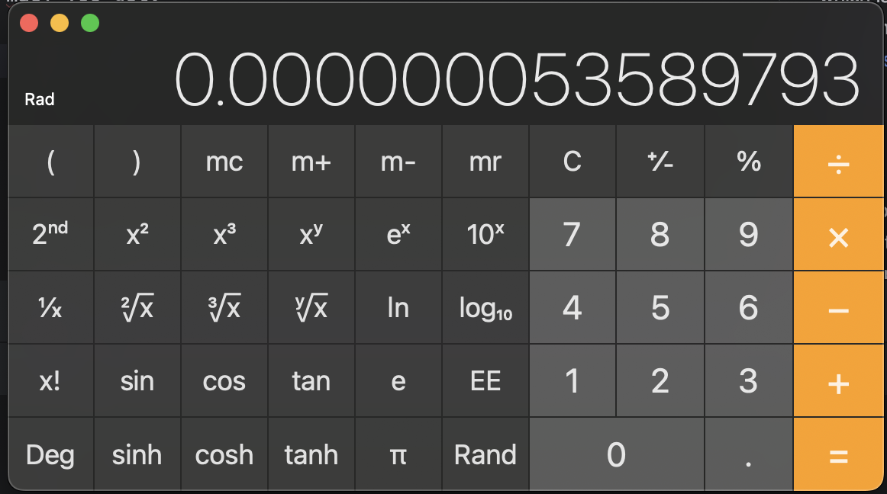

# Getting Started with weBASIC

Starting weBASIC brings you to the `READY.` prompt. A cursor (blinking underline) shows it is waiting for you.

<pre>
weBASIC v0.5

READY.
<cursor>_</cursor>
</pre>

## Your First Command

weBASIC is waiting for you to type a command.

In a world of mouse pointers and touch interface, this might seem a little old fashioned. _It is!_

However, if you are going to write code, you are going to have to type it in.
Further, dealing with a computer from a "command line" is common and expected for "computer people."
That's why you're hear right?

So let's type something in:

<pre>
PRINT "Hello World"
</pre>

You will get something like this:

<pre>
weBASIC v0.5

READY.
PRINT "Hello World"
Hello World

READY.
<cursor>_</cursor>
</pre>

_Congratulations_! You've made the computer do something for you.

## A Calculated Tutorial

Repeating what you tell it is not all that impressive. So let's make the computer do something useful. _Math_.

Just to make the point:

<pre>
PRINT 2+2
</pre>

The computer will respond with:

<pre>
PRINT 2+2
4

READY.
<cursor>_</cursor>
</pre>

And wait for your next command.

We can do something more complicated:

<pre>
PRINT -(2^4*9+14)
</pre>

And you'll get:

<pre>
PRINT -(2^4*9+14)
-158

READY.
<cursor>_</cursor>
</pre>

### Operator? Operator?

Did you understand every bit of that last equation? Let's break it down:

<pre>
-(2^4*9+14)
</pre>

What does that mean? And how is it calculated?

#### Start with Parentheses

The first rule of any equation is that things inside parentheses are done first.

In our equation we have:

<pre class="callout">
-<b>(</b>2^4*9+14<b>)</b>
</pre>

Why are those parentheses there? Let's try it without:

<pre>
PRINT -2^4*9+14
158

READY.
<cursor>_</cursor>
</pre>

What happened to that being negative?

#### Keeping It In Order

The computer has an "order of operations". This means that an equation is broken apart into
pieces, and these pieces are calculated in order of the "importance" of the operators.

One of the less important operators is the negation (also called "unary minus") operator. Pretty much
everything has precedence over that. That means without the parenthesis to separate that negation from
the rest of the equation, the first value is negative two (-2) and that is the value used to calculate
the first operation.

Which is a "caret" (^). What does that mean?

#### Who Has The Power?

The "caret" (^) operator means "to the power of".

So:

<pre class="callout">
-(<i>2<b>^</b>4</i>*9+14)
</pre>

Means "two to the power of four", or two times two times two times two.

The result or 2^4 is:

<pre>
PRINT 2^4
16

READY.
<cursor>_</cursor>
</pre>

It so happens that the "power" operator (the caret) is the highest priority operator in the order of operations.

That's why without the parentheses, the first operation done is `-2^4`, which is 16. The negative is lost.

So, if the "power" operator is at the top of the order of operations, what's next?

Multiplication and division. There's a multiplication in our equation...do you see it?

#### Get With the Times

In math, multiplication is represented by a tilted cross or plus sign, like this: &times;

You might notice that key isn't on your keyboard. It is quite possible on your modern computer there is a way
you can get that multiplication symbol to show up. But when BASIC was created it was based on languages that
came before, and that symbol simply didn't exist anywhere on the keyboards of the day (with one interesting
exception that you'll have to discover elsewhere).

The asterisk (*) symbol _was_ common on every keyboard back then, just as it is today. And that was the symbol
chosen to represent multiplication.

So:

<pre class="callout">
-(<i>2^4<b>*</b>9</i>+14
</pre>

Means multiply the result of `2^4` (16) by 9. That gets a result of:

<pre>
PRINT 2^4*9
144

READY.
<cursor>_</cursor>
</pre>

Note that just as the standard multiplication symbol isn't available on your keyboard, 
the standard division symbol (&divide;) is not there either. BASIC, and pretty much every
other computer language, uses the slash -- the _forward slash_ (/) --  as the division operator.

#### What's Left to Add?

Unlike multiplication and division, the symbols for addition (+) and subtraction (-) _are_
on your keyboard. So just use those.

<pre class="callout">
-(<i>2^4*9<b>+</b>14</i>)
</pre>

Are you following this now? The total of everything (inside the parentheses) to the left of
the plus sign (+) -- equalling 144 -- is added to 14, for a total of:

<pre>
PRINT 2^4*9+14
158

READY.
<cursor>_</cursor>
</pre>

#### Feeling Negative

Now we're back to that opening minus sign (-), the one we mentioned earlier negates the value
it follows. That means:

<pre class="callout">
<b>-</b><i>(2^4*9+14)</i>
</pre>

Since everything inside the parentheses totals up to 158, negating that gets you:

<pre>
PRINT -(2^4*9+14)
-158

READY.
<cursor>_</cursor>
</pre>

The final answer.

<h5>Thinking Like a Computer</h5>

Take a look at the following equation:

<pre>
PRINT 4--2
</pre>

That might look like a typo at first. Two minus signs together like that?

But the computer is going to see it by priority of operators. Even though the minus sign (-)
pulls double duty as both the subtraction operator and the negation operator, the computer
will figure it out.

<pre class="callout"><i>4</i>--2</pre>

As it scans from left to right, it hits the first minus sign (-). Since it has just
seen a number (4), it knows this must be an operator: subtraction.

<pre class="callout"><i>4</i><b>-</b>-2</pre>

Now the computer is going to find the operands -- what is on the left and right of this
operator that needs to be subtracted?  Looking left it sees the 4. Looking right it sees...
a minus sign (-).

<pre class="callout">4-<b>-</b>2</pre>

But since it is looking for a value (not an operator), it assumes that must be a negation
operation, which itself looks right to see the 2, so that means the right operand of our
subtraction is the result of "negate two" (-2).

<pre class="callout"><i>4<b>-</b>-2</i></pre>

From there, the computer steps back to the subtraction operation, which is now 
"four minus negative two" (4 - -2), and totals it up to get:

<pre>
PRINT 4--2
6

READY.
<cursor>_</cursor>
</pre>

### What's Your Function?

Let's look at another equation:

<pre>
PRINT SIN(3.1415926)
</pre>

The computer will come back with:

<pre>
PRINT SIN(3.1415926)
5.3589793170057245e-8

READY.
<cursor>_</cursor>
</pre>

Maybe you'll recognize that's a very small number. We'll come back to that in a moment.

What's this `SIN` about? SIN is how BASIC represents the geometric sine _function_.

A function is something that takes a value (sometimes more, sometimes _none_) and
applies some formula to it to return a new value. The value you want the function
to operate on must always be placed in parentheses following the function name.

So:

<pre class="callout">
<b>SIN</b>(<i>3.1415926</i>)
</pre>

Means get the sine of 3.1415926, which is _close to_ pi (&pi;). Note that the function SIN
takes a value in [Radians](https://en.wikipedia.org/wiki/Radian), where the circumference of
a circle is equal to twice pi (2*&pi;)

#### It's Science!

So the sine of pi is 0, but 3.1415926 is not _quite_ pi. The sine of 3.1415926 is _close_ to zero.
A very small number, as mentioned above. If you take the sine of pi on, for example, the
built-in scientific calulator on a mac, you get:

weBASIC returns a value of:

<pre>
5.3589793170057245e-8
</pre>

These are the same number. weBASIC has formatted the answer in **Scientific Notation**.
This means value is shifted by a power of 10 greater or less until there is one significant
digit before the decimal. Then the power of 10 is noted at the end of the number followed by
an `e`.

So:

 - <tt>100 = 1&times;102 = 1e2</tt>
 - <tt>0.01 = 1&times;10-2 = 1e-2</tt>
 - <tt>0.000000053589793 = 5.3589793&times;10-8 = 5.3589793170057245e-8</tt>

(well, on that last one, the weBASIC answer has more significant digits, but is effectively the same)

### Where to Next?

There is much more you can do directly from the `READY.` prompt in weBASIC, but very little of it
is useful if you can't keep it and reuse it.

That means it is time to write some programs.

[Why don't you go write one?](./first-program.md)

- [Home](./index.md)
- [Your First weBASIC Program](./first-program.md)
- [Learn the weBASIC Language](./language.md)
- [weBASIC reference](./reference/index.md)
