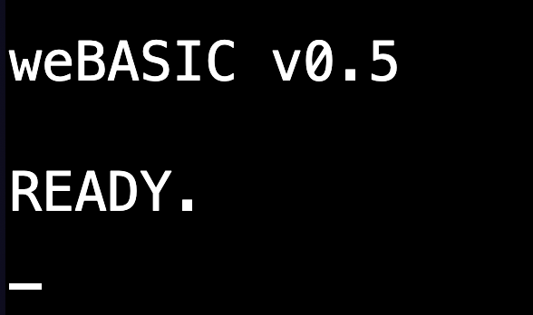

# [weBASIC]

_A BASIC that runs in the browser that is both retro and modern_

- [Why weBASIC](#why-webasic)
- [Getting Started](#getting-started)
- [About the Language](#about-the-language)
- [Troubleshooting](#troubleshooting)

## [Why weBASIC?]

weBASIC has been created to provide an introductory programming language to host on a modern computer.

At one time, BASIC was the "lingua franca" of computers. From the late 70's through the 80's a "personal computer"
would almost always boot into a BASIC language interpreter. Although most of these computers had a wide range of
software available to them, the default boot-up state was one where the computer owner was invited, expected even,
to write their own programs.

BASIC was a language created for learning programming. It uses (mostly) easy-to-understand words as commands,
it has a (mostly) straightforward syntax (the way in which those commands are given), and it is built around
some core ideas that force someone writing BASIC to "think like a programmer."

But all these early computers leveraged BASIC for one other important thing: giving the computer owner access
to the features of their computer. Although it was true that most computers of the era could "talk" BASIC, the
actual underlying computers were _very_ different. They had different ways of rendering graphics and generating
sound, for example. The BASIC that came with these computers, to varying extents, gave the owner access to those
features.

Compare this to modern computers. The out-of-the-box experience of any contemporary computer is one of an 
operating system designed primarily (one could even argue _exclusively_) to run software. You boot it up the
first time, and work through connecting to the internet, getting your browser up and going, and maybe getting
a few more programs (such as for email or office productivity) and and going.

If you want to actually write your own programs, well then you're into the weeds. Often you'll need to get to the
command line -- something kept pretty well hidden, even locked behind "admin" access. You'll need to download
at least some kind of software (or know how to get at pre-installed programming languages hidden away on your
machine). You'll need a development environment, or know how to get at text or code editors. All of this is
kept tucked away as much as possible.

To be honest, this is just fine. Most people don't want a computer to program it. But what about the people --
and more importantly the children -- who do? There are options. [Scratch](https://scratch.mit.edu/about)
is a language created to teach programming to children. It's pretty neat. It is also very far away from the
typical modern programming language. Scratch teaches programming _concepts_, but it doesn't really teach
_programming_.

An entire generation of software engineers were raised on BASIC, and computers that booted right to a prompt
where any BASIC command could be entered and executed. That generation did pretty well for itself, and there
is at least some evidence that subsequent generations are having a harder time entering the software field.
One potential reason for this is that there has been a loss of connection between the software you use and
how software in general works. Not understanding the basics (pun intended) of programming makes modern
software feel like magic.

weBASIC is an attempt to address this -- by giving a "programming first" environment to a modern computer,
using a proven introductory programming language, and providing access to the features of that computer that
people enjoy.

Welcome to weBASIC. Your computer is waiting for you. Tell it what you want it to do.

[top](#webasic)

## [Getting Started]

There are two forms of weBASIC:

 - Embedded: a form of weBASIC with limited file storage support able to be run directly in the browser.
 - Local: a form of weBASIC that runs local to your computer and has access to your local file system.

The fastest way to get started is to run the embedded version.

Simply [GO HERE](https://localhost:6510)

You will start out in the *LIVE* mode:

A cursor (blinking underline) shows it is waiting for you to type a command.

At this point, you can choose where to go next:

 - [Getting Started with weBASIC](./getting-started.md)
 - [Your First weBASIC Program](./first-program.md)
 - [Learn the weBASIC Language](./language.md)
 - [weBASIC reference](./reference/index.md)

[top](#webasic)

## [About the Language]

BASIC was introduced in 1964 as a language for beginners. It steals a command set largely from FORTRAN --
a contemporary programming language that had a command set that was a nice balance between efficiency and
ease-of-understanding. Originally it was a batch-processed language, requiring programs to be submitted for
execution. Quickly BASIC morphed into a live-interpreted language, giving users immediate feedback on their
efforts.

BASIC became very popular in the computer hobbyist community, and when the MIPS Altair 8800 -- considered by
many to be the real breakthrough "personal computer" -- came out in 1975 it soon came with a BASIC language
interpreter. We can thank Bill Gates (and Paul Allen) for this. BASIC was the perfect language for the
"personal computer". Soon it was a standard -- if you owned a computer it "spoke" BASIC.

The original BASIC language consisted of about 25 commands and statements, about 10 functions, and a
further 8 operators (don't worry if you don't understand the difference). The language never really had a
"standard", and as BASIC was adapted to new computers new commands were added, existing commands were
modified, and the language morphed to fit the computer and the whims of those developing BASIC for it.

weBASIC tries to follow this trend, giving your modern computer a BASIC environment to play in. It keeps
the "basics" of BASIC: line numbers are required, the original commands are supported (albeit with a few
improvements). weBASIC also adds many new commands, statements, functions, and even some operators. Many
of these are drawn from earlier dialects of the language, a few are unique to weBASIC itself.

The goal of weBASIC is to be a language that lets you _EXPLORE_. Explore the ideas of programming a
computer, explore important computer science concepts, and explore the capabilities of your computer.

So...go EXPLORE!

[top](#webasic)

## [Troubleshooting]

As issues arise with weBASIC, look here for information as how to work around them (until, hopefully, they
are addressed in a subsequent update).

- [Mac and the Keyboard](#mac-and-the-keyboard)

### [Mac and the Keyboard]

By default the CTRL left/right arrow key sequences are mapped
to Mission Control. As a result, they never get to the browser.
It is also possible that META left/right won't make it to the
browser either.

Keyboard controls for moving the cursor have been set up to
work around this for now. But if you still are encountering
problems, you may need to search through keyboard settings
on the Mac and in your applications to find and disable/remap
sequences that prevent the proper use of weBASIC inputs and
editing.

[top](#webasic)
